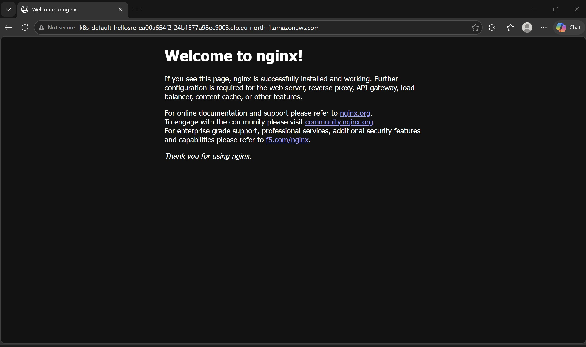
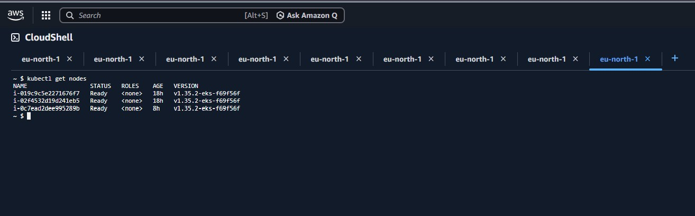
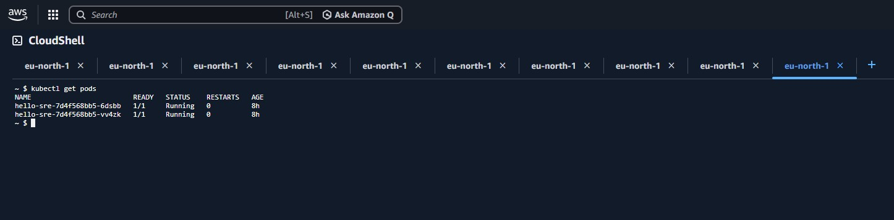
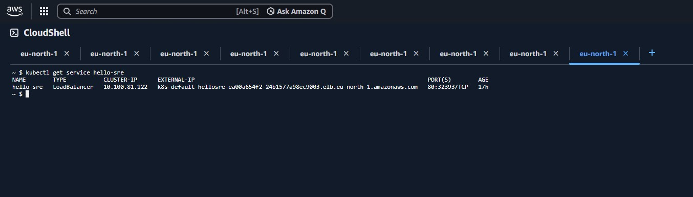
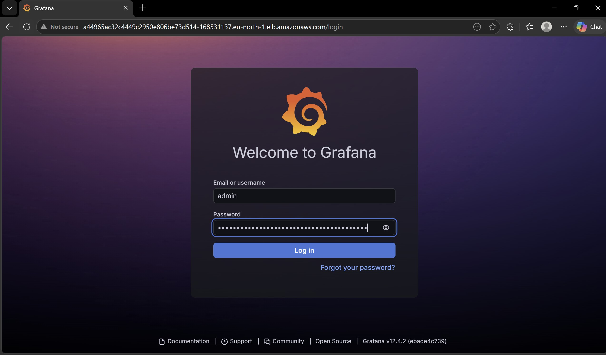
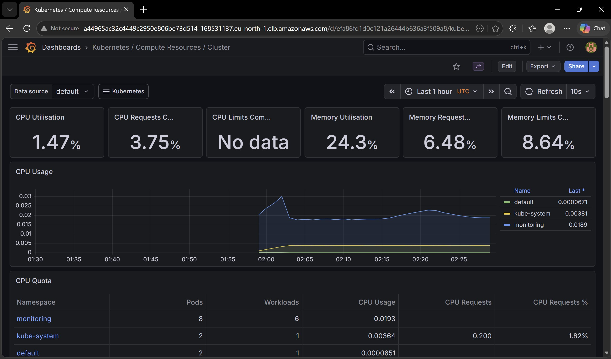
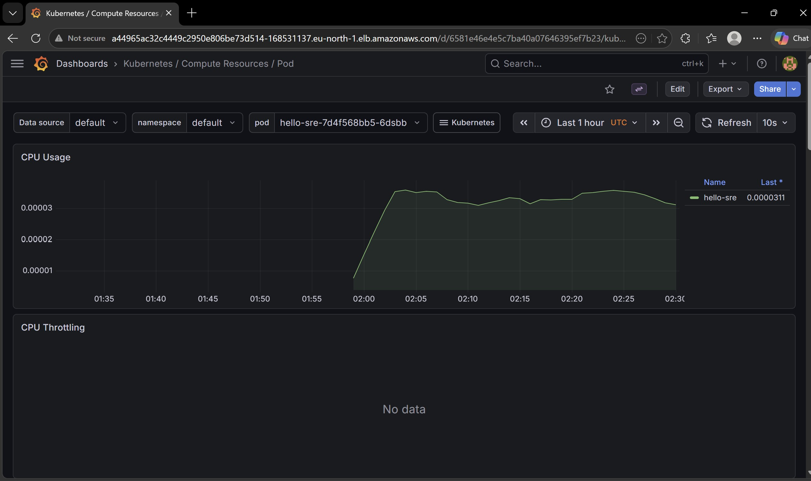

# 🚀 Production-Ready SRE Demo System

## Project Overview
This project demonstrates a complete production-ready Site Reliability Engineering (SRE) infrastructure on AWS. I built a Kubernetes cluster, deployed a containerized application, and implemented full observability with Prometheus and Grafana.

## Architecture
- **Cloud Provider:** AWS (EKS, EC2, VPC, LoadBalancer)
- **Orchestration:** Kubernetes (EKS Auto Mode)
- **Containerization:** Docker (nginx:alpine)
- **Monitoring:** Prometheus + Grafana stack
- **High Availability:** 2 pod replicas across 3 worker nodes

## What I Built

### ✅ Kubernetes Cluster on AWS EKS
- 3 worker nodes (t3.micro for cost efficiency)
- Auto-scaling configuration
- High availability setup

### ✅ Containerized Application
- nginx web server with 2 replicas
- LoadBalancer for public access
- Zero-downtime deployment capability

### ✅ Production Monitoring Stack
- Prometheus for metrics collection
- Grafana for visualization
- Pre-configured dashboards for cluster, node, and pod metrics

## Screenshots

### Live Application

### Kubernetes Infrastructure

### Grafana Monitoring Dashboards

## Technologies Used
| Category | Technologies |
|----------|--------------|
| Cloud | AWS (EKS, EC2, VPC, LoadBalancer) |
| Containers | Docker, nginx |
| Orchestration | Kubernetes (EKS) |
| Monitoring | Prometheus, Grafana |
| CLI Tools | kubectl, AWS CLI, Helm |

## Key SRE Principles Demonstrated
- **Observability:** Full metrics collection and visualization
- **Scalability:** Multi-replica deployment with auto-scaling nodes
- **High Availability:** 2+ replicas across multiple nodes
- **Infrastructure as Code:** All configurations are declarative YAML files
- **Monitoring & Alerting:** Prometheus metrics with Grafana dashboards

## How to Reproduce
1. Create an EKS cluster on AWS
2. Deploy the nginx application with 2+ replicas
3. Expose via LoadBalancer service
4. Install Prometheus & Grafana using Helm
5. Access dashboards to monitor metrics

## What I Learned
- Managing Kubernetes clusters on AWS EKS
- Containerizing applications with Docker
- Deploying and scaling applications on Kubernetes
- Setting up production monitoring with Prometheus & Grafana
- Configuring LoadBalancers for external access

## Future Improvements
- Add CI/CD pipeline with GitHub Actions
- Implement automated alerts with AlertManager
- Add service mesh (Istio) for advanced traffic management
- Create custom Grafana dashboards for application metrics

## Contact
Sahan Lahiru Gunathilaka

linkedin.com/in/sahan-gunathilaka-93453579 
